# BEL Cars For You

## 1 Abstract

Dies ist eine App, die die Funktion hat, Autos von Privatpersonen zu mieten. Man kann sich registrieren und einloggen.
Dabei sollte man danach nach Autos und Motorrädern suchen können.  
Wenn man das Auto mieten möchte, kann man an eine Anfrage senden oder anrufen. Die Telefonnummer ist dabei optional
anzugeben.

Man kann auch als Benutzer seine eigenen Autos inserieren zum Vermieten. Diese kann man natürlich auch wieder
runternehmen, wenn man dies so möchte.

Der Benutzer kann auf Wunsch auch sein gesamtes Konto löschen.

Optional:
Wenn einem das Auto gefällt, kann man es liken und dies wird dann unter Likes gespeichert. Man kann als Vermieter den
Preis pro Tag angeben für das beliebige Fahrzeug, Das System fragt den Mieter, wielange er das Auto haben will und
automatisch den Preis berechnen.

## 2 GUI Design

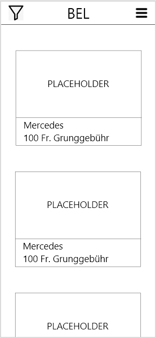

Dies ist unsere HomePage. Hier gelangt man, sobald die App aufgestartet ist. Man kann sich Autos zum Vermieten
anschauen. Wenn man auf den Icon oben links klickt, kann man die Liste filtern. Oben rechts gibt es einen Drawer, der
aufgeht auf Klick. Hier kann man auf die LoginPage navigieren oder zur ProfilePage.
---

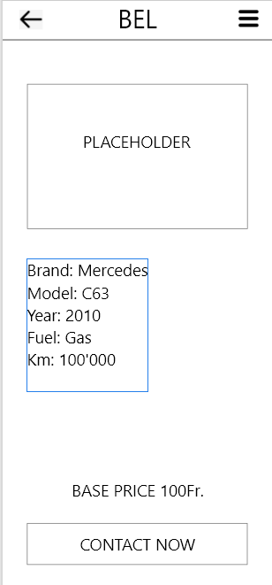

Hier navigiert man, sobald man auf ein Auto klickt. Es werden dann Infos zu diesem Auto aufgelistet. Wenn man auf den
unteren Button klickt, gelangt man auf die CredentialsPage.
---

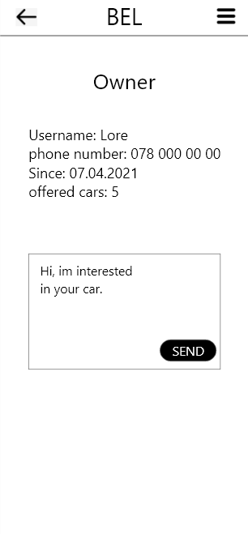

Hier werden Infos zum Vermieter aufgelistet. Man kann einen Text eingeben und dann auf Send klicken. Nun wird dieser
Text und eine Anfrage per Email an den Vermieter gesendet.
---

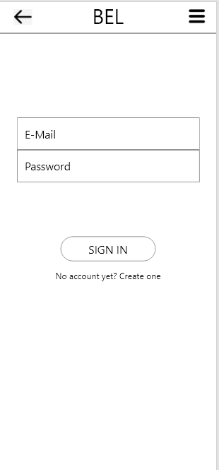

Hier kann man sich mit der Email einloggen. Wenn man auf den unteren Text klickt, wird man zur RegisterPage
weitergeleitet.
---

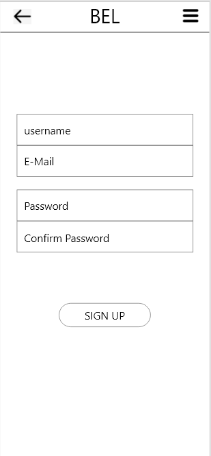

Hier kann man sich ganz einfach registrieren. Der Benutzername wird verwendet, um später anderen Benutzern angezeigt
werden zu können. Die Email wird verwendet, um die Anfragen an diese Email zu schicken, die für die Autos kommen.
---

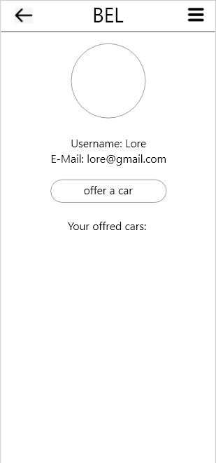

Hier werden die Profildaten angezeigt. Wenn man auf den Button klickt, gelangt man auf die UploadCarPage. Unten werden
noch die vermieteten Autos angezeigt.
---

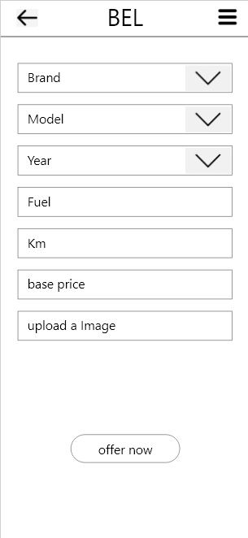

Hier kann man ein Auto zum Vermieten hochladen. Man muss alle Felder ausfüllen und ein Bild hochladen. Dann auf den
Button unten klicken, um das Auto hochzuladen.
---

## 3 Umsetzung

Die App beinhaltet mehr Seiten als geplant, da immer mehr Ideen zusammen kamen und dadurch auch mehr Funktionen dazu
kamen. Die App benötigte mehr Benutzerschnittstellen, damit die zusätzlichen Ziele realisiert werden konnten. Wie schon
erwähnt hat die App nicht nur mehr Seiten, sondern auch mehr Funktionen. Da die Anfangsziele sehr einfach umzusetzen
waren und dadurch auch immer wieder bessere Ideen sich weiterentwickelt haben.

Hier einige Beispiele:

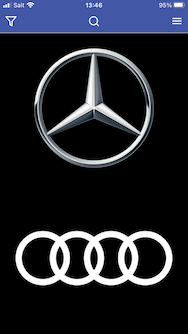 Die HomePage wurde nicht wie gedacht umgesetzt, anstatt alle Autos direkt
anzuzeigen, muss man zuerst eine Marke spezifisch wählen.

---

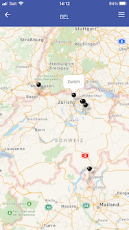 Hier ein Beispiel von userer Map mit den Standorten.

---

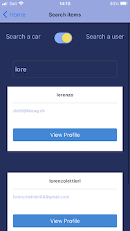 Hier kann ein Auto oder ein User gesucht werden.

## 4 Colors

Wir haben uns für Blautöne entschieden, da es nicht zu dunkel aber auch nicht zu hell ist. Diese sind aber noch nicht in
den Mockups vorhanden, da diese nur Skizzen sind.

## 5 Diagramme

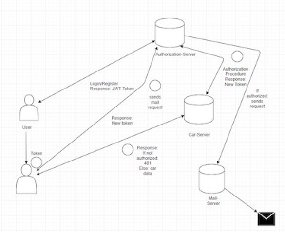
Netzwerkdiagramm

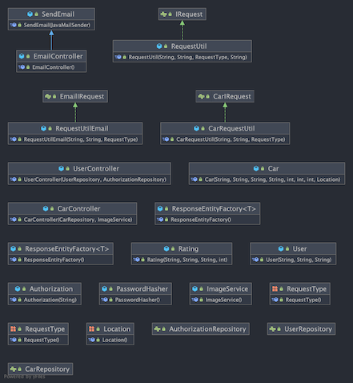
UML-Backend

## 6 Quellen

API für die Autos: https://vpic.nhtsa.dot.gov/api/

Bilder:

    Mercedes-Logo: https://www.google.com/url?sa=i&url=https%3A%2F%2Fseeklogo.com%2Fvector-logo%2F213484%2Fmercedes-benz&psig=AOvVaw2qjMTw-vp6EdKssw4_dPxy&ust=1621596561826000&source=images&cd=vfe&ved=0CAIQjRxqFwoTCOjVx42U2PACFQAAAAAdAAAAABAD
    Audi-Logo: https://d3wo5wojvuv7l.cloudfront.net/t_rss_itunes_square_1400/images.spreaker.com/original/00cd7d112e9e8769677ff9aabd3996a   4.jpg
    BMW-Logo: http://cdn.shopify.com/s/files/1/0447/7376/9381/collections/BMW-Logo_1200x1200.png?v=1596892483
    Lamborghini-Logo: https://images.hdqwalls.com/download/lamborghini-car-logo-3840x2400.jpg
    VW-Logo: https://logonews.fr/wp-content/uploads/2019/09/Capture-d%E2%80%99e%CC%81cran-2019-09-18-a%CC%80-11.10.37.png
    Tesla-Logo: https://i.pinimg.com/originals/bd/cd/74/bdcd74a980c6a8e8dbba91c23e3689af.png
    Hyundai-Logo: https://cittoncars.co.za/wp-content/uploads/2020/08/hob-hyundai.png
    Toyota-Logo: https://wallpapersplanet.net/sites/default/files/toyota-wallpapers-34288-3815629.png
    Honda-Logo: https://api.salesrater.net/uploads/media/dealer_logos/dealerlogo_brown_honda__6a6e9029.jpg
    Ferrari-Logo: https://performansx.files.wordpress.com/2016/04/ferrari_silver_logo_hd_images_f32c.jpg?w=640
    Porsche-Logo: https://cdn.wallpapersafari.com/60/54/c8yFed.jpg
    Bugatti-Logo: https://cutewallpaper.org/21/bugatti-logo-wallpaper/Bugatti-Logo-Bugatti-Veyron-logo-iphone-Android-wallpaper-.jpg
    NoCarsFound-Logo: https://www.wa-gulf.com/wp-content/uploads/2017/01/%D9%A2%D9%A0%D9%A1%D9%A7%D9%A0%D9%A1%D9%A2%D9%A4_%D9%A2%D9%A0%D9%A2%D9%A9%D9%A4%D9%A3.png

## 7 Fazit

Nach etwa knapp 2 Monaten Arbeit ist das Projekt nun zu Ende. Grundsätzlich konnten alle Ziele realisiert werden, die
geplant waren. Die App ist vollständig funktionsbereit, somit kann sie von echten Benutzern verwendet werden (mehr dazu
im Kapitel 3).

Im Team konnte sehr gut gearbeitet werden. Es wurde offen und sehr viel kommuniziert. Auf Ideen anderer ist eingegangen
worden. Manchmal gab es viele Probleme, z.B. beim Pullen von Daten in einen Dropdown. Doch dank Coach Ivan konnten so
gut wie alle Probleme behoben werden.

Ein weiteres Problem, dass erläutert werden muss, ist Expo. Expo ist ein sehr unstabiles Tool, welches leider verwendet
wurde für dieses Projekt. Meist stürzte die App ab aufgrund von Expo oder manche vom Team konnten das Projekt gar nicht
mehr starten. Die Lösung für diese Probleme war das Projekt neu zu klonen. Aufgrund von diesen Vorkommnissen ratet das
Team BEL von Expo dringendst ab.

Zwar wurden alle Ideen erfüllt, jedoch gibt es noch ein paar Ideen, die vorhanden waren, um die App zu erweitern. Ein
Beispiel dafür ist das Einsetzen einer eigenen KI. Dabei war die Idee, eine KI zu entwickeln, die Benutzerdaten sammelt,
damit man mithilfe von den Daten interpretieren kann, welches Auto dieser Benutzer wohl gerne hätte. Dies ist zwar eine
sehr umfangreiche Idee, vorallem im Basislehrjahr, dennoch war es schade, dass man dies nicht versuchen konnte.
Ansonsten konnte alles erledigt werden, dass geplant war, z.B. Emailversendung, Bewertungssystem oder eine persönliche
Liste, wo man seine Lieblingsautos abspeichern kann.
